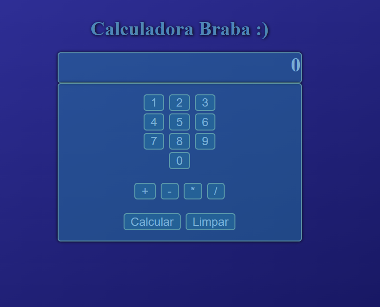

# Calculadora Braba :)

Uma calculadora simples feita com HTML, CSS e JavaScript.  
Permite realizar operações básicas como soma, subtração, multiplicação e divisão.



## 🚀 Como usar

1. Baixe ou clone o repositório:
   ```bash
   git clone https://github.com/seu-usuario/nome-do-repo.git

2. Abra o arquivo index.html no seu navegador.

## 🧠 Funcionalidades

- ✅ Interface intuitiva

- ✅ Evita operadores repetidos

- ✅ Aceita múltiplos dígitos

- ✅ Prevenção contra 0 inicial desnecessário

- ✅ Estilo com gradiente e botões arredondados